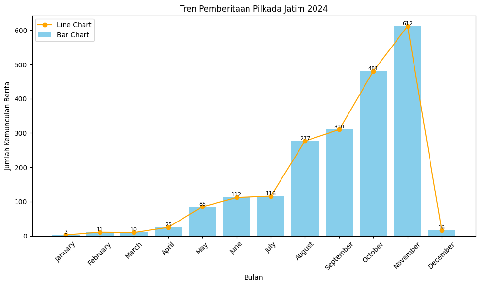
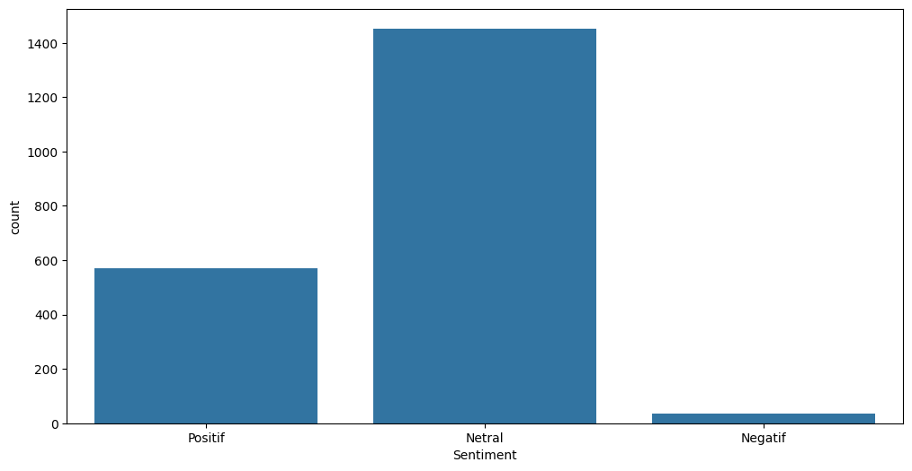
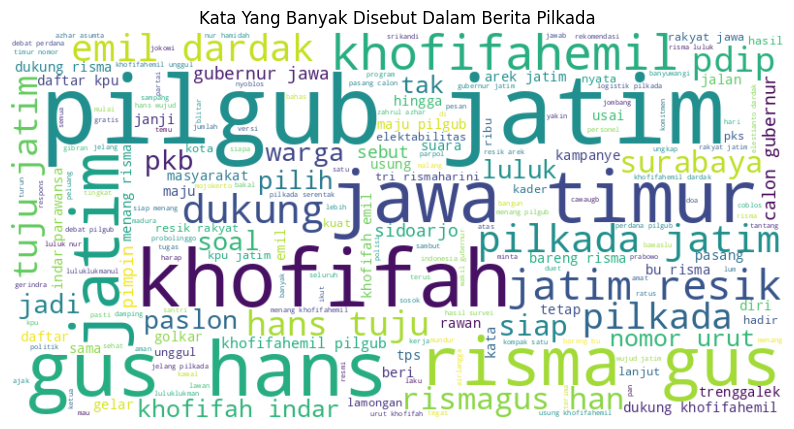

# Sentiment Analysis of East Java 2024 Regional Election

An NLP project analyzing news articles related to the 2024 East Java regional election using text preprocessing, sentiment analysis, and exploratory data analysis.

## Tools & Libraries

* Python
* Pandas
* NLTK
* Sastrawi
* VADER
* Scikit-learn
* Matplotlib
* Seaborn
* Plotly
* WordCloud

## Key Process

* Text preprocessing
* Tokenization
* Stopword removal
* Indonesian stemming
* Sentiment classification
* Exploratory data analysis (EDA)
* Data visualization

## Dataset

The dataset consists of Indonesian news articles related to the 2024 East Java regional election, including article titles and publication dates.

## Visualization

The project includes visualizations of news trends, candidate coverage, and sentiment analysis.

### News Distribution by Candidate Pair

### Monthly News Publication Trend

### Sentiment Distribution

### Word Cloud

## Project Notebook

The complete analysis is available in the Jupyter Notebook.

**[Open in Google Colab](https://colab.research.google.com/drive/1faqv1UWajrGk3mYwTgpE0LDkL34nnRYO?usp=sharing)**
